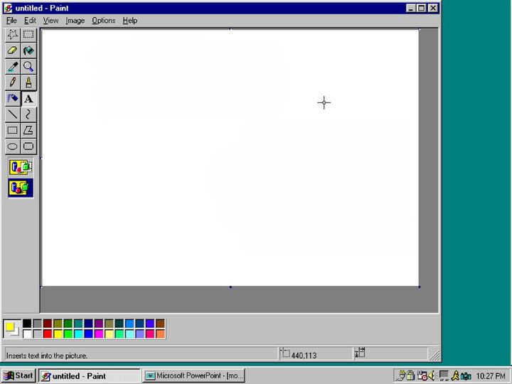

## Nostalgia
MS Paint is one of the first programs I used when I first got introduced to Computers in early 90s. The ability to use a *mouse* to draw on a monitor just blew my mind.



While I could never make a decent *art*-piece on it, I spent endless hours scribbling on the screen, and then using the bucket tool to fill my sections with a solid color.
It was nothing short of magic, that the computer could automatically identify my lines and fill in the color I wanted. Especially so, since I could not do it as accurately with a pen and paper.

In my recent days of practising competitive coding, I came across these **Count Islands** problems, and imagine my suprise when I realised, this was how the bucket tool works. So let's define a problem and then go ahead and solve it.

## Question

Given a 2d matrix of color codes, a *click* point and a replacement color code, write a function such that it returns the modified array with all contiguous regions from the *click* point are replaced with the replacement color. For the sake of brevity, lets assume color codes are represented by an integer instead of the traditional hex-code.
A *contiguous* region is defined as when adjacent horizontal or vertical cells have the same color code.
The following example should illustrate this better.

*Example*
```md
**Input**:
colors = [
  [ 1, 0, 0, 0, 0, 2, 3, 4 ],
  [ 1, 0, 0, 0, 2, 2, 3, 4 ],
  [ 1, 0, 2, 0, 0, 3, 3, 4 ],
  [ 0, 1, 0, 0, 0, 2, 3, 4 ],
  [ 1, 0, 0, 0, 0, 2, 3, 4 ],
  [ 1, 0, 0, 0, 0, 2, 0, 0 ],
  [ 1, 0, 0, 0, 0, 2, 0, 1 ],
  [ 1, 0, 0, 0, 0, 2, 0, 3 ],
]

click = [2,3]
replace = 3

**Output**
[
  [ 1, 3, 3, 3, 3, 2, 3, 4 ],
  [ 1, 3, 3, 3, 2, 2, 3, 4 ],
  [ 1, 3, 2, 3, 3, 3, 3, 4 ],
  [ 0, 1, 3, 3, 3, 2, 3, 4 ],
  [ 1, 3, 3, 3, 3, 2, 3, 4 ],
  [ 1, 3, 3, 3, 3, 2, 0, 0 ],
  [ 1, 3, 3, 3, 3, 2, 0, 1 ],
  [ 1, 3, 3, 3, 3, 2, 0, 3 ],
]
```

## Discussion
Given a point, you need to explore in all possible directions, to discover which points are having the same color and replace them with the new color. Hence, a DFS approach is the answer to this conundrum.

* Identify the color at the *click* point.
* Now explore and replace the color with the *target* color.
* Stop exploring when the point you are on has a different color from the one identified at the *click* point or you have reached the boundaries of the array.


## Solution
```js
/**
 * @param {Array} colors
 * @param {Array} click
 * @param {Number} replace
 */
const FloodFill = (colors, click, replace = 0) => {
  const [x, y] = click;
  const colorToReplace = colors[x][y];
  exploreAndFill(colors, x, y, colorToReplace, replace);
};


const exploreAndFill = (colors, x, y, colorToReplace, targetColor)=>{
  const yMax = colors.length;
  const xMax = colors[0].length;

  if( x < 0 || x >= xMax || y < 0 || y >= yMax) return;

  if(colors[x][y] != colorToReplace) return;

  colors[x][y] = targetColor;

  if(x > 0){
    exploreAndFill(colors, x-1, y, colorToReplace, targetColor);
  }
  if(y > 0){
    exploreAndFill(colors, x, y-1, colorToReplace, targetColor);
  }
  if(x+1 < xMax){
    exploreAndFill(colors, x+1, y, colorToReplace, targetColor);
  }
  if(y+1 < yMax){
    exploreAndFill(colors, x, y+1, colorToReplace, targetColor);
  }
}

```
<iframe height="800px" width="100%" src="https://repl.it/@jagzviruz/Flood-Fill?lite=true" scrolling="no" frameborder="no" allowtransparency="true" allowfullscreen="true" sandbox="allow-forms allow-pointer-lock allow-popups allow-same-origin allow-scripts allow-modals"></iframe>
