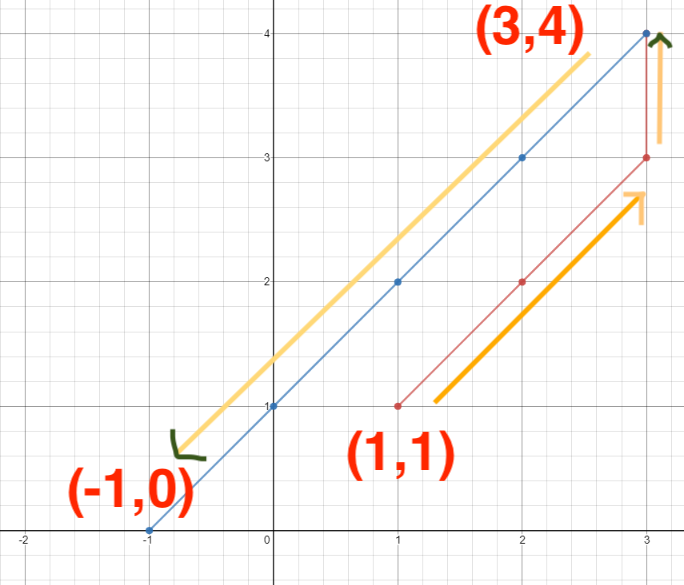

### Question

On a plane there are *n* points with **integer** coordinates *points[i] = [xi, yi]*. Your task is to find the minimum time in seconds to visit all points.

You are bound by these rules:

- In one second always you can either move vertically, horizontally by one unit or diagonally (it means to move one unit vertically and one unit horizontally in one second).
- You have to visit the points in the same order as they appear in the array.

Bonus : Print the path traversed to reach each of the points.

Example
```md
**Input**: points = [[1,1],[3,4],[-1,0]]
**Output**: 7
**Explanation**: One optimal path is **[1,1]** -> [2,2] -> [3,3] -> **[3,4]** -> [2,3] -> [1,2] -> [0,1] -> **[-1,0]**
Time from [1,1] to [3,4] = 3 seconds
Time from [3,4] to [-1,0] = 4 seconds
Total time = 7 seconds
```

### Discussion
As described, you can make one move in the *horizontal*, *vertical* **OR** the *diagonal* direction. In a simple environment, if you had just two points, your priority would always be to move towards the destination point. If the destination point is on different *cross* and *vertical* axes, you can cover maximum ground by moving in the diagonal direction. Once you reach one of the axis of the destination point, you can start taking steps in the corresponding direction.

### Solution
```js
/**
 * @param {number[][]} points
 * @return {number}
 */
var minTimeToVisitAllPoints = function(points) {
    let time = 0;
    const numStops = points.length
    const start = points[0];
    const destination = points[numStops - 1];
    let tmpStop = start;
    let i = 0;
    const path = [[...tmpStop]];
    const moveX = (curr, next) => {
        if(curr[0] > next[0]){
            curr[0] = curr[0] - 1;
        } else {
            curr[0] = curr[0] + 1;
        }
    }

    const moveY = (curr, next) => {
        if(curr[1] > next[1]){
            curr[1] = curr[1] - 1;
        } else {
            curr[1] = curr[1] + 1;
        }
    }

    while(tmpStop[0] !== destination[0] || tmpStop[1] !== destination[1]){
        let next = points[i+1];

        if(next[0] == tmpStop[0] && next[1] != tmpStop[1]){
            moveY(tmpStop, next);
            time++;
        } else if (next[0] != tmpStop[0] && next[1] == tmpStop[1]){
            moveX(tmpStop, next);
            time++;
        } else if (next[0] != tmpStop[0] && next[1] != tmpStop[1]){
            moveX(tmpStop, next);
            moveY(tmpStop, next);
            time++;
        } else {
            i++;
        }
        path.push([...tmpStop]);
    }
    console.log(path);
    return time;
};
```

<iframe height="1400px" width="100%" src="https://repl.it/@jagzviruz/Minimum-Time-Visiting-All-Points?lite=true" scrolling="no" frameborder="no" allowtransparency="true" allowfullscreen="true" sandbox="allow-forms allow-pointer-lock allow-popups allow-same-origin allow-scripts allow-modals"></iframe>
